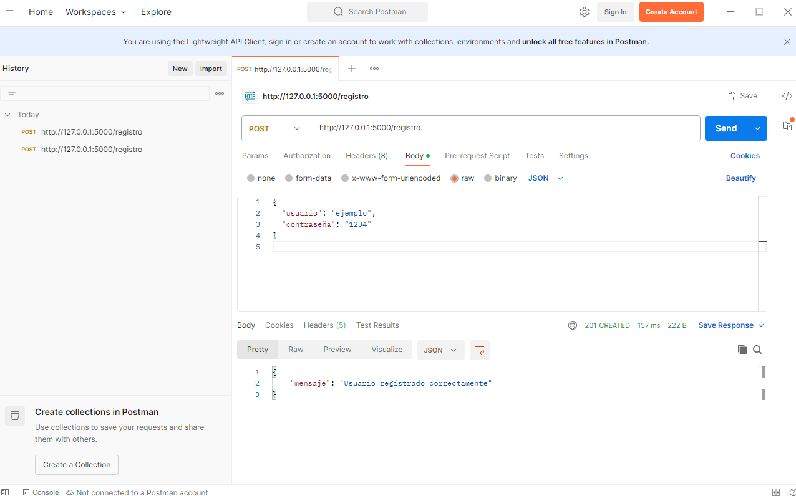
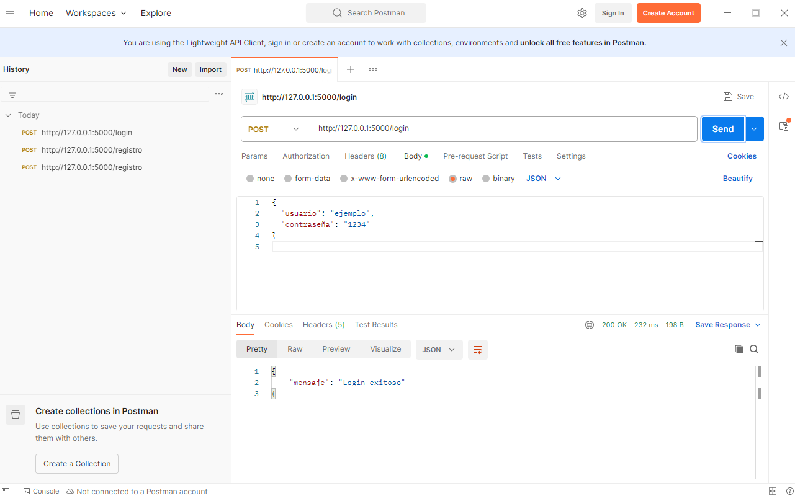
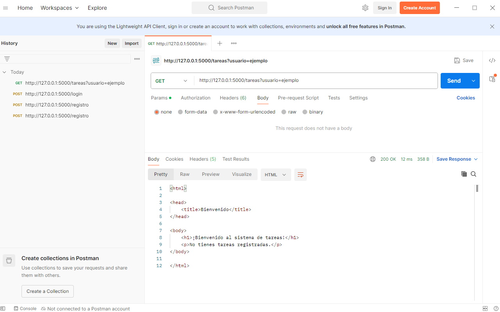
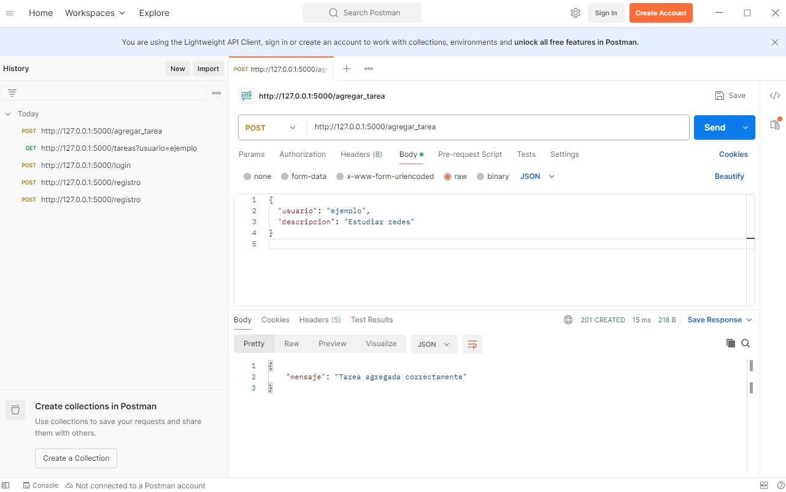
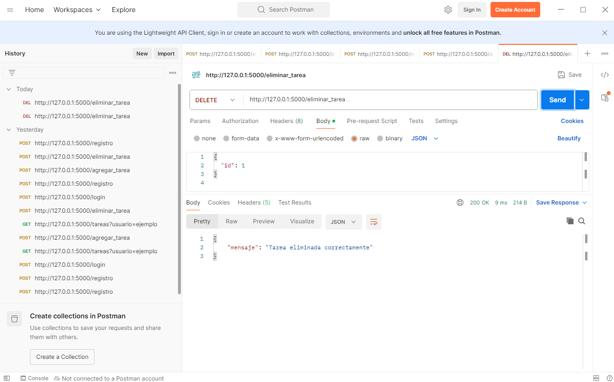

# PFO 2: Sistema de Gestión de Tareas con API y Base de Datos

## Descripción

Este proyecto consiste en una API REST desarrollada con Flask y persistencia en SQLite. Permite:

- Registrar usuarios con contraseñas protegidas.
- Iniciar sesión mediante autenticación básica.
- Acceder a una interfaz de bienvenida.
- Agregar, eliminar y visualizar tareas personales.

---

## Instrucciones para ejecutar el proyecto y probarlo

### 1. Requisitos

- Python 3.x
- Dependencias:
  - Flask
  - requests
  - werkzeug (incluido con Flask)

Instalación de dependencias:

```bash
pip install flask requests
```

---

### 2. Archivos

- `app.py`: Arranca el servidor y registra los módulos.
- `api.py`: Define los endpoints de la API REST.
- `db.py`: Contiene la lógica de inicialización de la base de datos SQLite.
- `cliente.py`: Cliente de consola que permite interactuar con la API.
- `README.md`: Este archivo.
- `tareas.db`: SBase de datos SQLite generada automáticamente.

---

### 3. Cómo ejecutar el proyecto

1. **Ejecuta el servidor** (crea la base de datos y activa la API):

```bash
python app.py
```

2. **Ejecuta el cliente en otra terminal**:

```bash
python cliente.py
```

3. Desde el cliente podrás:
   - Registrar un nuevo usuario.
   - Iniciar sesión con usuario y contraseña.
   - Ver tus tareas actuales.
   - Agregar una nueva tarea.
   - Eliminar una tarea por ID.

---

## Endpoints implementados

| Método | Ruta             | Descripción                                   |
|--------|------------------|-----------------------------------------------|
| POST   | `/registro`      | Registra un nuevo usuario                     |
| POST   | `/login`         | Verifica credenciales de usuario              |
| GET    | `/tareas`        | Muestra HTML de bienvenida y tareas (si se pasa `usuario`) |
| POST   | `/agregar_tarea` | Agrega una nueva tarea para el usuario dado   |
| POST   | `/eliminar_tarea`| Elimina una tarea por ID                      |

---

## Uso desde el cliente

- Después de iniciar sesión, el cliente permite:
  1. Ver tareas actuales.
  2. Agregar una tarea nueva.
  3. Eliminar una tarea existente (requiere ID).
  4. Cerrar sesión.

---

## Capturas de pantalla de pruebas exitosas

> Las siguientes imagenes muestran los resultados de los test realizados con Postman:

- 
- 
- 
- 
- 
- 

---

## Respuestas Conceptuales

### ¿Por qué hashear contraseñas?

Hashear contraseñas protege la seguridad de los usuarios al evitar que las contraseñas se almacenen en texto plano. Si la base de datos es comprometida, los atacantes no podrán obtener las contraseñas reales fácilmente. El uso de funciones hash unidireccionales (como las que proporciona `werkzeug.security`) permite que el servidor verifique las contraseñas sin necesidad de conocerlas.

---

### Ventajas de usar SQLite en este proyecto

- **Simplicidad**: No requiere configuración adicional.
- **Ligereza**: Ideal para proyectos pequeños o educativos.
- **Portabilidad**: Todo se guarda en un único archivo `.db`.
- **Integración directa con Python**: Se usa el módulo `sqlite3` incluido en la biblioteca estándar de Python.

---


## Autor

Trabajo práctico PFO 2 – Ezequiel Hernán Frega
